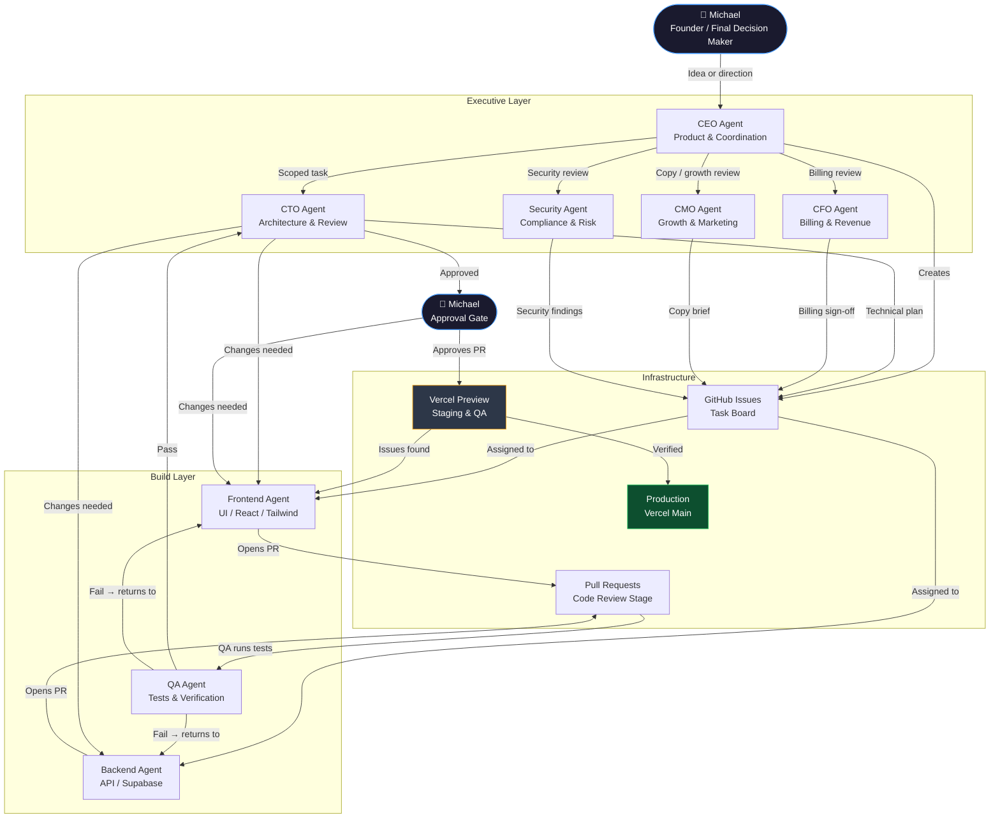
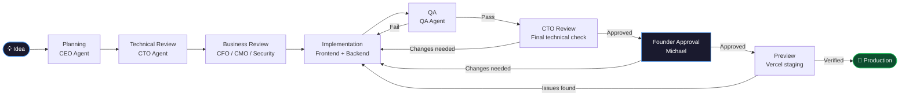

# Agent Operating System — Visual Workflow

---

## Diagram 1 — Full System Map

How work moves from Founder idea to production, and which agents are involved at each stage.

---

## Diagram 2 — Approval Flow

Sequential gate-by-gate view from idea to production.

---

## Agent Color Key

| Color | Meaning |
|---|---|
| Dark blue | Michael (Founder / decision gate) |
| Green | Production (final destination) |
| Amber | Preview / staging (verification stage) |
| Default | Agents and process steps |

---

## Key Rules Shown in These Diagrams

1. Michael is the only person who can approve production deployment.
2. QA must pass before CTO review begins.
3. CTO must approve before Founder review.
4. Failures at any stage return to Implementation — not back to Founder.
5. Preview deployment is verified before production merge.
